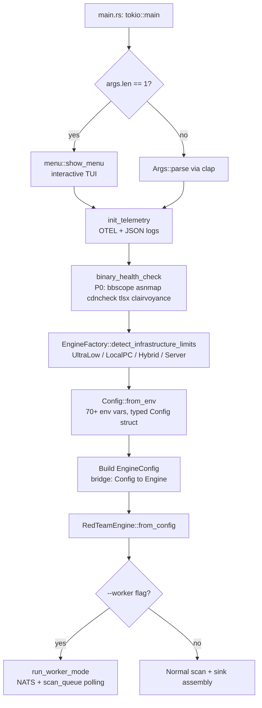
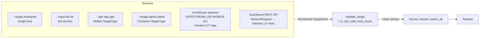
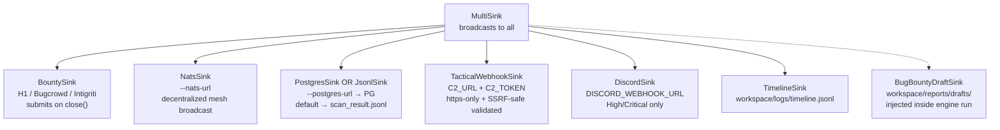
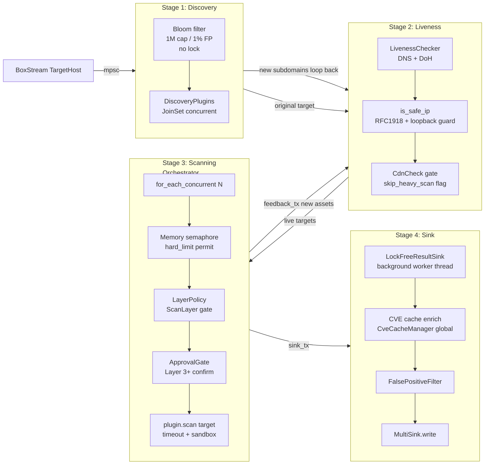
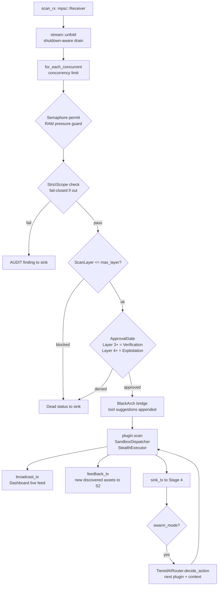
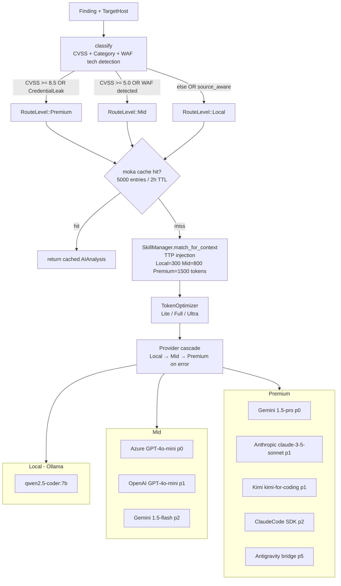
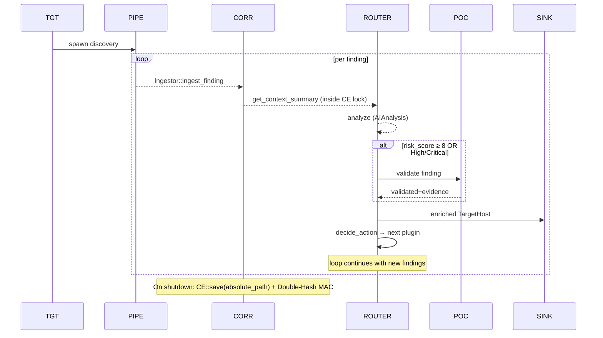
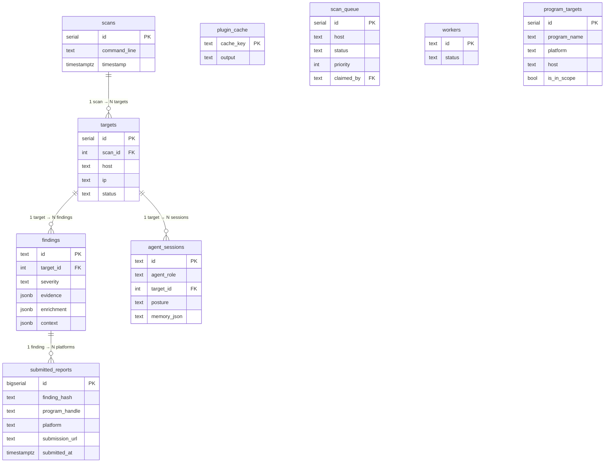
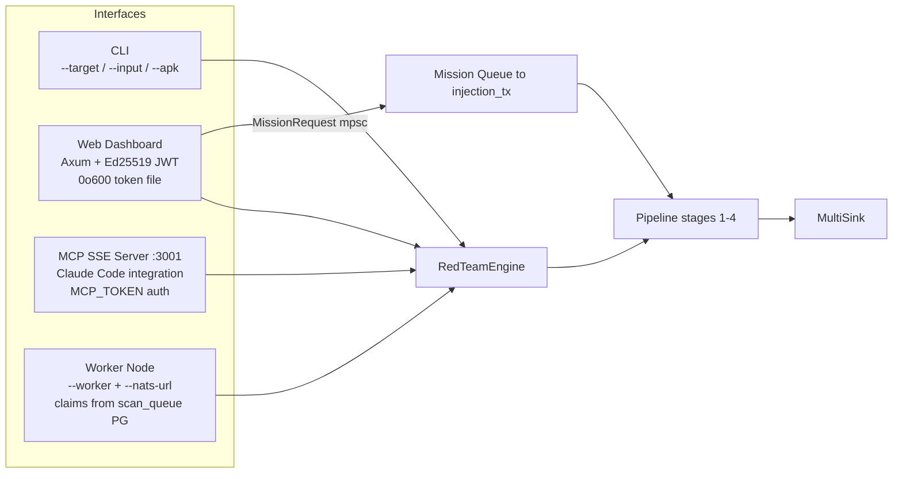

# Mimikri Core — System Architecture Reference

> Derived from source code (`src/`). Authoritative. Last verified: 2026-05-13 (V15.1 Hardened).

---

## 1. Bootstrap & Configuration Flow



**Key invariants:**
- `Config::from_env()` is the single env-var read point. Engine never reads env directly.
- `MIMIKRI_WORKSPACE` controls all output paths. Default: `./workspace`.
- Hardware profiles set auto-concurrency: UltraLow=10, LocalPC=30, Hybrid=60, Server=150.

---

## 2. Target Ingestion Sources



All targets validated before entering the pipeline. Invalid targets logged and dropped.

---

## 3. Sink Assembly (main.rs)



`PostgresSink` and `JsonlSink` are mutually exclusive. `BugBountyDraftSink` is added by `RedTeamEngine` inside `run_pipeline` and `run_autopilot` — not in `main.rs`.

---

## 4. Pipeline: 4-Stage Channel Topology



**Bypass rules:**
- `TargetType::Mobile` and `TargetType::Container` skip Stage 1 and Stage 2 entirely.
- CDN-detected targets have `skip_heavy_scan = true`; heavy scanner plugins check this flag.

---

## 5. Orchestrator: Plugin Execution Model



**Priority Scheduling (V14.6):**
The Orchestrator implements a two-round dispatch model to ensure critical scanners run first:
1. **Round 1 (Priority)**: Plugins listed in `tactical_context["priority_plugins"]` (e.g., `auth_state_machine` for SSO subdomains).
2. **Round 2 (Standard)**: All other plugins matching capability/layer requirements.

**ScanLayer hierarchy** (`capability_layer.rs`):
```
Passive(0) < Discovery(1) < Scanning(2) < Verification(3) < Exploitation(4) < PostExploitation(5)
```
Default: `Scanning`. Unlock with `--max-layer exploitation`.

---

## 6. AI Router: Tiered Intelligence Cascade



**Routing rules:**
- `source_aware` evidence type → always Local (no cloud API burn for code analysis).
- WAF/CDN tech (Cloudflare, Akamai, Incapsula, etc.) → escalate to at least Mid.
- Cache key = `SipHash-1-3(host + ip + finding_id + category)` — HashDoS resistant.
- `401 Unauthorized` from provider → log critical, continue cascade.
- Injection cache: 1000 entries, 30-min TTL — prevents redundant SkillManager calls.

---

## 7. Autonomous Agent Loop (--autonomous)



All steps logged to `ActivityLog` → `workspace/logs/timeline.jsonl` (JSONL append-only). `AdaptiveContext` tracks current posture (Ghost/Strike/Breach) and `CavemanLevel` for prompt compression.

---

## 8. Plugin Taxonomy

| `reconnaissance` | always | 1-2 | cdncheck, tlsx, shodan, netlas, certstream, waymore, gitleaks, subfinder |
| `enumeration` | always | 2 | nuclei, katana, ffuf, shuffledns, s3scanner, cloudenum, rustscan |
| `exploitation` | always | 4 | gopherus, ssrfmap, ghauri, kxss, sqlmap, dalfox, hydra, impacket |
| `intelligence` | always | 1 | chaos, securitytrails, criminalip, greynoise, searchsploit |
| `verification` | always | 3 | PocValidator (AI-driven PoC generation + execution) |
| `detection_evasion` | always | any | StealthPolicy, HumanJitter |
| `reporting` | always | sink-side | BugBountyReport (H/C/M → MD), AttackChain consolidated |
| `compliance` | always | 2 | policy-file driven audit |
| `lateral_movement` | `sovereign` | 5 | AD coercion, Responder, Coercer |
| `persistence` | `sovereign` | 5 | WebShell, C2, SSH key inject, registry autorun |
| `privilege_escalation` | `sovereign` | 5 | CredentialInjection, ProcessInjection, Certipy, PrivescHunter |

`sovereign` feature flag gates all post-exploitation at compile time. Not compiled in default release builds.

---

## 9. Persistence Layer (PostgreSQL)



3 migrations:
- `20260428` — core schema (scans, targets, findings, objectives, agent_sessions, plugin_cache, mcp_stats, checkpoints, deduplication, cve_cache)
- `20260506` — distributed worker queue (workers, scan_queue + priority index)
- `20260508` — bug bounty program targets (program_targets, h1/bc/intigriti platform column)
- `20260508000003` — [V14.7] bug bounty submission deduplication (`submitted_reports`)

---

## 10. Interfaces: Dashboard, MCP, Worker



**Dashboard auth:** Ed25519 `SigningKey` generated per-session. JWT token written to `workspace/logs/dashboard.token` with `mode(0o600)`. Token valid 24h (`exp` claim).

**Worker mode:** polls `scan_queue` (PostgreSQL), claims via `claimed_by` field, runs the same `RedTeamEngine`. NATS kill-switch propagates `egress_lock` to all nodes.

---

## 11. OPSEC & Safety Gates

| Gate | Location | Effect |
|---|---|---|
| `validate_target` | main.rs ingestion | Rejects malformed targets before stream |
| `is_ssrf_safe_host_async` | C2 URL validation | Blocks private/loopback for webhook sinks |
| `is_safe_ip` | Stage 2 liveness | Blocks RFC1918/loopback resolved IPs |
| `ScanLayerPolicy` | Stage 3 orchestrator | Hard cap on destructive plugin layers |
| `ApprovalGate` | Stage 3 orchestrator | Requires human confirm for Layer 3+ |
| `ScopePolicy` | Stage 3 orchestrator | Fail-closed if target outside program scope |
| `ProxyManager::wait_for_readiness` | Engine startup | Blocks scan until stealth infra is ready |
| `CancellationToken` | All stages | Graceful drain on Ctrl-C; no finding loss |
| `SSRF-safe C2_URL` | TacticalWebhookSink | `https`-only + SSRF guard before registration |
| `ParentDir traversal check` | CorrelationEngine `save`/`load` | Rejects any path with `..` components via `Component::ParentDir` match |
| `Double-Hash MAC` | CorrelationEngine | `SHA256(K \|\| SHA256(K \|\| D))` prevents length-extension attacks + state poisoning |
| `Mandatory Secret` | CorrelationEngine | `MCP_TOKEN` required for persistence; bails if missing |
| `Absolute Path` | SwarmOrchestrator | `dirs::data_local_dir` prevents CWD dependency issues |
