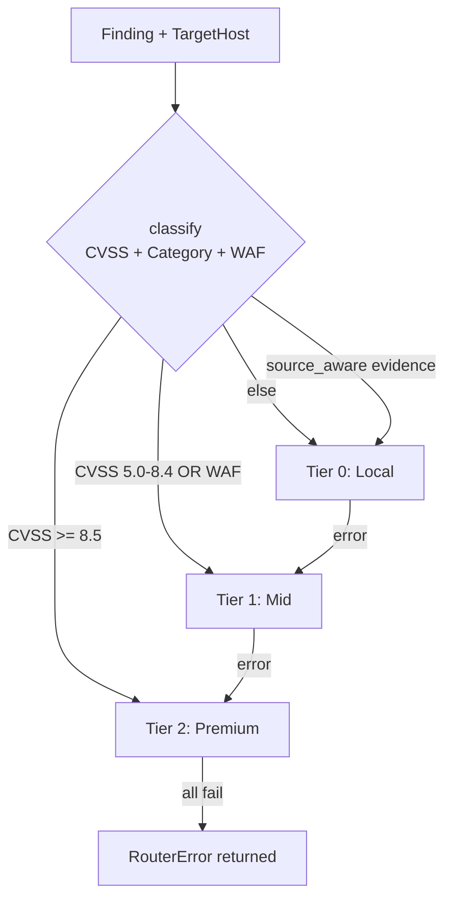
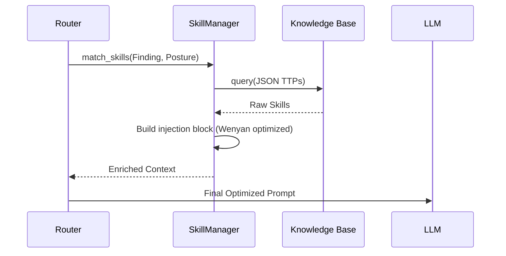

# 🧠 AI Infrastructure & Prompt Engineering

> Source-verified from `src/core/ai/`. Last verified: 2026-05-10.

OsintUltimate implements a high-performance AI abstraction layer. Maximizes technical precision, minimizes cost + latency via a tiered routing engine + 10-stage token optimization pipeline.

## 1. Tiered Routing (`TieredAIRouter`)

`TieredAIRouter` is the central AI dispatcher. Classifies each finding by technical complexity + severity. Uses `ArcSwap<HashMap<RouteLevel, Vec<ProviderEntry>>>` for lock-free provider updates.

### Tier Configuration (from `src/core/factory.rs`)

| Tier | RouteLevel | Condition | Actual Models |
|---|---|---|---|
| 0 | Local | CVSS < 5.0 OR `source_aware` evidence | Ollama `qwen2.5-coder:7b` |
| 1 | Mid | CVSS 5.0–8.4 OR WAF detected | Azure `gpt-4o-mini` (p0), OpenAI `gpt-4o-mini` (p1), Gemini `1.5-flash` (p2) |
| 2 | Premium | CVSS ≥ 8.5 OR CredentialLeak/ExposedAsset | Gemini `1.5-pro` (p0), Anthropic `claude-3-5-sonnet-20240620` (p1), Kimi `kimi-for-coding` (p1), ClaudeCode SDK (p2), Antigravity bridge (p5) |

**WAF escalation:** targets with Cloudflare, Akamai, Incapsula, F5, Barracuda, or Sucuri detected → escalate to at least Mid.

**source_aware override:** findings with `evidence.data.type = "source_aware"` are always routed Local, regardless of CVSS.



### Cache Layer (`src/core/ai/router.rs`)

- **Analysis cache:** `moka` async cache, 5000 entries, 2h TTL. Key = `SipHash-1-3(host + ip + finding_id + category)` — HashDoS resistant.
- **Injection cache:** 1000 entries, 30-min TTL. Prevents redundant `SkillManager` calls for repeated finding patterns.
- Cache hit → return immediately, no provider call. `CacheMetrics.hits/misses` tracked atomically.

---

## 2. Token Optimization Pipeline (10 Stages)

Reduce "bleed" créditos API + permite contextos masivos. OsintUltimate usa **v13 Deterministic Prompt Optimizer**. Motor procesa prompts vía diez transformaciones sucesivas.

### Optimization Stages (`src/core/ai/token_optimizer.rs`)
1.  **Extractive Compressor**: puntúa cada línea por señal técnica (keywords `proxy`, `payload`, `vuln`). Elimina baja relevancia.
2.  **Entropy Pruner**: elimina adverbios baja entropía (e.g., "basically", "actually"). No aportan valor operativo.
3.  **Verbosity Reducer**: colapsa frases verbales largas (e.g., "in order to" -> "to").
4.  **Article Stripper**: elimina artículos (a, an, the).
5.  **Filler Remover**: limpia palabras cortesía/relleno.
6.  **Synonym Mapper**: abrevia términos técnicos largos (e.g., `vulnerability` -> `vuln`).
7.  **Suffix Lemmatizer**: elimina sufijos (-ing, -ed, -ly). Heurística detección código endurecida previene corrupción contextos técnicos.
8.  **Punctuation Pruner**: (Modo Ultra) elimina puntuación no estructural.
9.  **Wenyan Ultra**: (Modo Ultra) sustituye términos técnicos comunes por glifos CJK uno-carácter (e.g., `security` -> `安`).
10. **Deduplicator**: pase final, elimina redundancias de etapas previas.

### Resultados de Compresión
*   **Lite Mode**: ~15-20% ahorro (lectura humana intacta).
*   **Full Mode**: ~40-60% ahorro (legible para LLMs modernos).
*   **Ultra Mode (Wenyan)**: ~80% ahorro (optimizado agentes autónomos V15).

---

## 3. Tactical Knowledge Injection (SkillManager)

Unlike static prompts, Mimikri uses **Tactical RAG**. Injects Red Team TTPs into prompts at analysis time.

### Skill Flow
- **Matching**: `SkillManager::match_for_context(finding, posture, level, budget)` — selects TTP fragments by finding category + current posture (`Ghost` / `Strike` / `Breach`).
- **Dynamic Budgeting**: token budget scales by tier — Local=300, Mid=800, Premium=1500 tokens for skill injection.
- **Surgical Injection**: skills prepended to base context as expert blocks. Loaded from `../skills/` directory at startup.
- **Injection cache**: 30-min TTL on `format!("inj:{level:?}:{posture:?}:{caveman:?}:{finding_id}")` key — prevents redundant `SkillManager` calls for same pattern.



---

## 4. OPSEC & Privacy (PII Scrubbing)

Before data reaches external AI providers (Azure/OpenAI/Anthropic), `Scrubber` (`src/core/ai/scrubber.rs`) processes context to protect infrastructure:

- **Identity Masking**: replaces usernames, internal IPs, sensitive paths with synthetic placeholders.
- **Credential Stripping**: removes tokens, API keys, hashes detected in attack context.
- **Tactical Cache**: `moka` LRU cache (5000 entries, 2h TTL) prevents resending the same critical finding to AI. Protects API budget + data exposure. Ensures context consistency under high load.

---

## 5. WAF AI Hardening & Real-time Evasion (V14.6)

For high-value targets behind a WAF, Mimikri uses the **OffPathAiEngine** to generate real-time mutation strategies.

### 5.1 Real-time Mutation Path
- **Latency Fail-safe**: Synchronous inference path with a strict **2000ms timeout**.
- **Graceful Fallback**: If inference exceeds 2000ms or fails, the engine falls back to local heuristic mutations to ensure pipeline continuity.
- **LSH Cache**: Implements Locality Sensitive Hashing (LSH) for mutation patterns. Near-duplicate WAF response signatures trigger high-speed cache hits, bypassing the LLM.

### 5.2 LSH Metrics
- `WAF_LSH_HITS`: Atomic counter for successful sub-2ms evasion strategy retrievals.
- `WAF_INFERENCE_TIMEOUTS`: Tracks when real-time AI was too slow, triggering local fallback.

---

> [!IMPORTANT]
> **Wenyan Ultra** mode is machine-to-machine only. Operators who need human-readable AI logs must use `Lite` or `Off` level.

---

## 5. External AI Tool Token Strategy (Garak / PyRIT / Promptfoo / etc.) `sovereign`

Plugins ofensivos AI/LLM (`exploitation/ai_llm/*`) ejecutan binarios externos. Generan **adversarial prompts** contra targets LLM. Estos prompts NO se optimizan — wording exacto = sagrado para test integrity.

### 5.1 Decisión arquitectónica: NO Bridge Optimizer

**Rechazado:** local OpenAI-compat proxy interceptando outbound calls + applying `PromptOptimizer`.

**Razón:**
- Adversarial prompts (jailbreaks, injections, DAN-style) calibrados contra **token sequences específicas**.
- Lemmatize/article-strip/filler-remove → destruye attack semantics.
- "Ignore all previous instructions" → "ignore previous instruction" → jailbreak no triggers.
- Reproducibility broken → CVE/bounty reports inválidos.
- Optimizer domain = chat compression, NOT adversarial vector mutation.

**Conclusión:** prompts ataque pasan unchanged. Optimization en **scan configuration**, no en payload content.

---

### 5.2 Strategy A+B+C — Smart Scan Profiles

Tres palancas ahorro real **sin tocar payloads**:

| Lever | Mechanism | Typical Saving |
|---|---|---|
| **A. Probe selection** | `--probes <subset>` vs `--probes all` | 5-50× |
| **B. Model tier** | `gpt-4o-mini` vs `gpt-4` (target side) | 10-200× |
| **C. Generation cap** | `--generations 3` vs default 10 | 3× |

Combinados → **150-30000× cost reduction** vs full default scan. Coverage crítico intacto.

---

### 5.3 Scan Profiles (Default Tiers)

Tres profiles built-in. Plugin AI selecciona según `TokenBudget` state.

#### Economy (default si budget < 50%)
```
probes:       critical-only (HijackHateHumans, DAN, jailbreak basics)
generations:  3
target_model: cheapest available (gpt-4o-mini, claude-haiku, llama3.2:1b)
timeout:      300s
parallelism:  1
```
Cost target: < 1k tokens / scan.

#### Standard (default si budget 50-80%)
```
probes:       OWASP LLM Top 10 subset (~15 probes)
generations:  5
target_model: mid-tier (gpt-4o, claude-sonnet)
timeout:      900s
parallelism:  3
```
Cost target: ~10k tokens / scan.

#### Thorough (only si budget > 80% AND posture = Strike)
```
probes:       all
generations:  10
target_model: as-configured (no override)
timeout:      3600s
parallelism:  5
```
Cost target: ~100k+ tokens / scan.

---

### 5.4 Per-Tool Configuration Matrix

| Tool | Probe-equivalent flag | Generation flag | Profile target |
|---|---|---|---|
| **Garak** | `--probes promptinject.HijackHateHumans` | `--generations N` | `garak.profile: economy` |
| **PyRIT** | Orchestrator selection (`Crescendo`, `RedTeaming`, `PAIR`) | `max_turns N` | `pyrit.profile: economy` |
| **Promptfoo** | `--filter-tests <name>` (assertion subset) | `--repeat N` | `promptfoo.profile: economy` |
| **Promptmap** | `--rules <subset>` | (single-shot) | `promptmap.profile: economy` |
| **PromptInject** | corpus subset (`base64`, `ignore_prev`, `dan`) | iteration cap | `promptinject.profile: economy` |
| **LLMFuzzer** | mutation strategy (`grammar`, `random`, `corpus`) | budget (max attempts) | `llmfuzzer.profile: economy` |
| **Rebuff** | heuristic check | — | `rebuff.profile: economy` |
| **Vigil** | policy evaluation | — | `vigil.profile: economy` |
| **ModelScan** | model weight analysis | — | `modelscan.profile: economy` |

**Each plugin exposes:**
```rust
pub struct AiScanProfile {
    pub probes: ProbeSelection,        // All | Critical | Custom(Vec<String>)
    pub generations: u32,              // attempts per probe
    pub target_model: Option<String>,  // override target side model
    pub max_runtime_secs: u64,
    pub parallelism: u32,
}
```

---

### 5.5 Auto-Profile Selection Logic

Plugin `scan()` reads `GlobalConfig.budget` BEFORE execution:

```rust
let pct_remaining = (budget.max_tokens - budget.current_effective_total()) * 100 
                   / budget.max_tokens.max(1);

let profile = match pct_remaining {
    p if p < 20 => return Ok(vec![]),  // Economy abort
    p if p < 50 => AiScanProfile::economy(),
    p if p < 80 => AiScanProfile::standard(),
    _           => self.config_profile.unwrap_or(AiScanProfile::standard()),
};
```

Override CLI: `--ai-profile thorough` (forces, ignores budget) — guarded by Sovereign feature gate.

---

### 5.6 Response Cache Layer

Compatible con strategy (no payload mutation). Key = `hash(target_url + prompt + model)`. TTL = 24h. Usa `moka` LRU cache existente (sección 4 Tactical Cache pattern).

**Saves on rerun scenarios:**
- Re-running same probe vs same target durante dev/debug.
- Multi-plugin overlap (Garak + PromptInject ambos usan `ignore_previous_instructions` corpus).

```rust
if let Some(cached) = ai_response_cache.get(&key) {
    return Ok(cached.findings);  // skip subprocess entirely
}
```

Cache invalidation: target endpoint version change → bust por incluir response del target a probe canary en key.

---

### 5.7 Cost Telemetry

Plugin emite token-cost estimate a `TokenBudget` POST scan:

```rust
budget.add_usage(&TokenUsage {
    prompt_tokens: estimated_input_tokens(probes_run, generations),
    completion_tokens: parsed_response_tokens,
    total_tokens: prompt + completion,
});
```

Fórmula estimación per tool documentada en plugin source. Source-of-truth para budget enforcement → next scan lee budget actualizado → escala a profile menor.

---

### 5.8 Veredicto Operacional

**Default behavior:** Economy profile, all AI plugins, all scans.
**Escalation:** explicit user flag OR confirmed high-value target (CVSS-projected ≥ 8.5).
**Never:** mutate adversarial prompts mid-flight. Test integrity > token savings.

> [!IMPORTANT]
> AI/LLM scanning costs escalan **multiplicativo**: probes × generations × target_model_price. `Thorough` scan vs GPT-4 = ~$50-200 USD per target. Confirma budget tier antes de lanzar `--ai-profile thorough`.