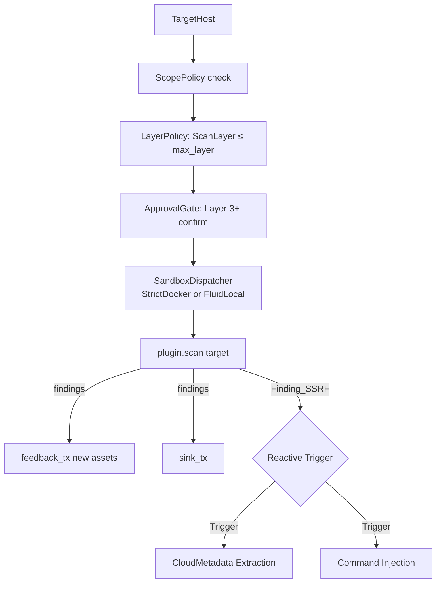

# Plugin Arsenal & Tool Registry

> Source-verified from `src/plugins/`. Last verified: 2026-05-10.
> `sovereign` = compile-time gated (`#[cfg(feature = "sovereign")]`). Not in default release builds.

---

## Plugin Execution Model

Plugins are not run all at once. The `Orchestrator` dispatches them based on the `ScanLayerPolicy` gate. Each plugin declares its `ScanLayer` in `PluginMetadata`.



**Reactive Triggers:**
The Orchestrator implements autonomous chaining for high-impact vulnerabilities:
- **SSRF → Cloud Metadata**: On `FINDING_SSRF`, immediately probes for AWS/GCP/Azure instance metadata.
- **SSTI → Commix**: On `FINDING_SSTI`, triggers OS command injection validation.
- **Deserialization → GadgetDetector**: On `JAVA-SERIAL`, triggers gadget chain discovery.

**ScanLayer thresholds:**

| Layer | Value | Examples |
|---|---|---|
| Passive | 0 | CertStream, passive OSINT, Shodan lookup |
| Discovery | 1 | Subfinder, Amass, DNSx, ASN mapping |
| Scanning | 2 | Nmap, Nuclei, HTTPx, Katana, Shuffledns |
| Verification | 3 | PocValidator, interaction checks |
| Exploitation | 4 | SQLMap, Ghauri, SSRF tools, XSS scanners |
| PostExploitation | 5 | C2, lateral movement, persistence (`sovereign`) |

Default `--max-layer scanning`. Use `--max-layer exploitation` to unlock Layer 4.

---

## Plugin Namespaces

### `reconnaissance` — Layer 1-2

Passive and active surface mapping.

| Plugin | Tool | Key env / config |
|---|---|---|
| passive subdomain discovery | subfinder, amass | — |
| ASN mapping | asnmap | — |
| CDN/cloud detection | cdncheck | — |
| TLS fingerprinting | tlsx | — |
| CertStream daemon | certstream | `CERTSTREAM_KEYWORDS` |
| Shodan lookup (Integrated) | sovereign_recon.rs | `SHODAN_API_KEY` |
| Netlas lookup (Integrated) | sovereign_recon.rs | `NETLAS_API_KEY`, `NETLAS_DAILY_BUDGET` |
| SecurityTrails (Integrated) | sovereign_recon.rs | `SECURITYTRAILS_API_KEY` |
| CriminalIP (Integrated) | sovereign_recon.rs | `CRIMINALIP_API_KEY` |
| Scope extraction | bbscope | — |
| GitHub dorking | github-dorks | `GITHUB_TOKEN` |
| Historical URLs | waymore, wayback | — |
| Secret scanning | gitleaks, trufflehog | — |
| Subdomain takeover | subzy | — |
| Altered subdomains | alterx | — |
| Internet-wide search | uncover | `SHODAN_API_KEY`, `CENSYS_API_KEY`, etc. |
| Pure DNS resolution | puredns | — |

---

### `enumeration` — Layer 2

#### Network

| Plugin | Tool | Notes |
|---|---|---|
| Port scanning | nmap, rustscan | configured by `NmapOptions` or `RustScanOptions` |
| Web probing | httpx | — |
| DNS resolution | shuffledns | `SHUFFLEDNS_PATH`, `SHUFFLEDNS_RESOLVERS`, `SHUFFLEDNS_WORDLIST` |
| Mass DNS (Wrapper) | massdns | Wrapped by `shuffledns` via `MASSDNS_PATH` |
| Service fingerprinting | naabu | — |
| DNS analysis | dnsx | — |
| AD User Enum | kerbrute | `KERBRUTE_USERLIST` wordlist required |
| AD/SMB Enum | enum4linux-ng | requires `enum4linux-ng` binary |

#### Web

| Plugin | Tool | Notes |
|---|---|---|
| Vulnerability templates | nuclei, tsunami | `NUCLEI_TAGS`, `NUCLEI_SEVERITY`, etc. |
| Web crawling | katana, gowitness | — |
| Directory brute-force | ffuf, feroxbuster | — |
| JS endpoint extraction | linkfinder, jsluice | finds `FINDING_JS_ENDPOINT` |
| Parameter discovery | arjun, x8 | — |
| Tech stack detection | whatweb | — |
| CRLF injection | crlfuzz | — |
| Endpoint discovery | kiterunner, wcd | — |
| CMS scanning | wpsec, nikto | — |
| Auth/SSO security | oauth-security, corsy | — |
| Secrets in JS | secretfinder | — |
| Historical URLs | waymore, gauplus | — |
| 403 bypass | nomore403 | — |

##### API Security

| Plugin | Tool | Notes |
|---|---|---|
| GraphQL discovery | clairvoyance, graphql-cop, inql | — |
| API fingerprinting | graphw00f | — |
| Fuzzing/Contract | schemathesis, crackql | — |
| Vulnerability scan | wcvs | — |

---

#### Cloud

| Plugin | Tool | Notes |
|---|---|---|
| Cloud auditing | scoutsuite, prowler | AWS, Azure, GCP compliance |
| AWS exploitation | pacu | — |
| S3 bucket scanner | s3scanner | `S3SCANNER_PATH`, `S3SCANNER_WORDLIST` |
| Cloud enumeration | cloudenum, cloudfox, cloudbrute | — |
| Kubernetes audit | kube-bench | — |

---

### `exploitation` — Layer 4

All exploitation plugins require `--max-layer exploitation` or higher.

| Plugin | Tool | Key config | Target |
|---|---|---|---|
| SSRF chain generator | gopherus | `GOPHERUS_PATH` | generates payloads for SSRF → RCE |
| SSRF mapper | ssrfmap, ssrf-king | `SSRFMAP_PATH` | blind SSRF + OOB detection |
| SQL injection | ghauri, sqlmap | `GHAURI_PATH` | modern SQLi |
| Reflected XSS | kxss, dalfox | `KXSS_PATH` | parameter reflection detection |
| NoSQL injection | nosqlmap | `NOSQLMAP_PATH` | MongoDB/Redis injection |
| Auth State Machine | custom | — | OAuth2/OIDC state fixation & step skipping |
| HTTP smuggling | smuggler, h2csmuggler | — | — |
| Template injection | tplmap | — | — |
| JWT exploitation | jwt-tool | — | — |
| Command injection | commix | — | — |
| File upload | upload-strike | — | — |
| Open redirect | openredirex | — | — |
| Cloud Metadata Extraction | custom | `ssrf_url` | Automated extraction of AWS/Azure/GCP credentials via SSRF |

#### Mobile

| Plugin | Tool | Target |
|---|---|---|
| Static analysis | jadx, apktool | APK/IPA decompilation |
| Secret extraction | apkleaks | hardcoded API keys |
| Dynamic analysis | frida, objection, drozer | runtime instrumentation |
| SAST | mobsf, mariana-trench | security analysis |

#### AI & LLM

| Plugin | Tool | Notes |
|---|---|---|
| Adversarial testing | garak, promptinject | jailbreaks, prompt injections |
| Red teaming | pyrit | multi-turn attack strategies |
| Fuzzing | llmfuzzer | — |
| Security gates | rebuff, vigil | testing AI firewalls |
| Scan profiles | promptfoo | evaluation & benchmark |
| Model scanning | modelscan | — |

#### Network

| Plugin | Tool | Notes |
|---|---|---|
| Brute force | hydra | — |
| SMB/AD | impacket, responder, netexec | — |
| NTLM coercion | petitpotam, coercer | — |

---

### `intelligence` — Layer 1

OSINT aggregation and threat correlation. No active scanning.

| Plugin | Tool | Notes |
|---|---|---|
| Vulnerability DB | searchsploit | — |
| Threat Intel | greynoise | — |
| Template-based | jaeles, nuclei | — |

---

### `verification` — Layer 3

**PocValidator** (`src/core/validation/`): AI-driven PoC generation and verification.

1. `TieredAIRouter.analyze()` — generates a PoC hypothesis.
2. `ValidationGenerator` — transforms hypothesis into executable payload.
3. `ValidationExecutor` — runs payload via `StealthExecutor`.
4. `SovereignValidator` — verifies response confirms vulnerability.
5. Finding status updated to `ValidationStatus::Verified` or `Failed`.

Only triggers for High/Critical findings (risk_score ≥ 8 in autonomous mode).

---

### `detection_evasion` — any layer

- `StealthPolicy` — rate-limiting, header randomization, UA rotation.
- `HumanJitter` — random delay 100–1500ms between requests.
- `PayloadObfuscation` — Donut, Scarecrow for shellcode hardening.

---

### `reporting` — sink-side (no layer gate)

Two generators in `src/plugins/reporting/bug_bounty.rs`:

**`generate_reports(target)`** — per-finding Markdown for Medium+ severity:
- Filename: `<host>_<finding-id>.md`
- Sections: Description → Impact → Steps to Reproduce (curl command or nuclei template) → PoC (raw HTTP or JSON evidence) → Exploit Path → References

**`generate_attack_chain_report(target, findings)`** — consolidated multi-finding report:
- Mermaid `graph TD` visualization of attack chain
- Combined impact assessment
- Full chain walkthrough per phase

Both written to `workspace/reports/drafts/` by `BugBountyDraftSink`.

---

### `compliance` — Layer 2

Supply chain and policy-file driven audit.

| Plugin | Tool | Notes |
|---|---|---|
| SBOM analysis | syft, grype | — |
| Vulnerability scan | trivy, osv-scanner | — |
| Static analysis | semgrep | — |
| Cloud compliance | checkov, kubescape | — |
| Signature verify | cosign | — |

---

### `lateral_movement` `sovereign` — Layer 5

Active Directory coercion, credential relay.

| Plugin | Tool | Notes |
|---|---|---|
| AD Analysis | BloodHound | — |
| C2 Framework | Sliver, Ligolo-ng | — |
| Relay/Coercion | Responder, PetitPotam, Coercer | — |
| Execution | NetExec, Impacket | — |

---

### `persistence` `sovereign` — Layer 5

`PersistenceOrchestrator` generates formal `TacticalPlan`:

| Method | Description |
|---|---|
| `Havoc` | Advanced C2 framework integration |
| `SshKeyInjection` | Generates ephemeral Ed25519 keypairs |
| `WebShell` | Deploys obfuscated shells |
| `PersistentC2` | Deploys C2 implants with mTLS |
| `ScheduledTask` | Cron/systemd-based persistence |
| `ServiceModification` | Modifies existing service configs |
| `RegistryAutorun` | Windows registry autorun (via Sovereign) |
| `ProcessInjection` | Injects into existing process memory |

C2 session lifecycle: `Staged → Deployed → Established → Sovereign`

---

### `privilege_escalation` `sovereign` — Layer 5

CredentialInjection, ADCS abuse (Certipy), local PrivEsc automation (PrivescHunter).

---

## Plugin Trait Contract

```rust
#[async_trait]
pub trait ScannerPlugin: Send + Sync {
    fn name(&self) -> &'static str;
    fn metadata(&self) -> PluginMetadata;      // layer, risk_level, capabilities, cost, mitre_attacks
    fn capabilities(&self) -> Vec<Capability>;
    async fn check_dependencies(&self) -> Result<bool>;
    async fn scan(&self, target: &TargetHost) -> Result<Vec<Finding>>;
    fn set_feedback_channel(&self, tx: Sender<TargetHost>) {}  // optional, for asset injection
}
```

`PluginMetadata.is_destructive` — if true, orchestrator enforces approval regardless of layer. `poc_mode` — non-destructive test mode available.

---

## Dynamic Plugin Loading

External `.so` plugins loaded from `--plugins-dir <DIR>` at runtime via `DynamicPluginLoader`. Signature verified (Ed25519) before loading. ABI compatibility checked. Runs through same `SandboxDispatcher` + `LayerPolicy` chain as built-in plugins.

---

## P0 Tools (Required at Startup)

These are checked by `binary_health_check()` at startup. Missing = warning, not abort:

```
bbscope   asnmap   cdncheck   tlsx   clairvoyance   subfinder   shuffledns   httpx
```
