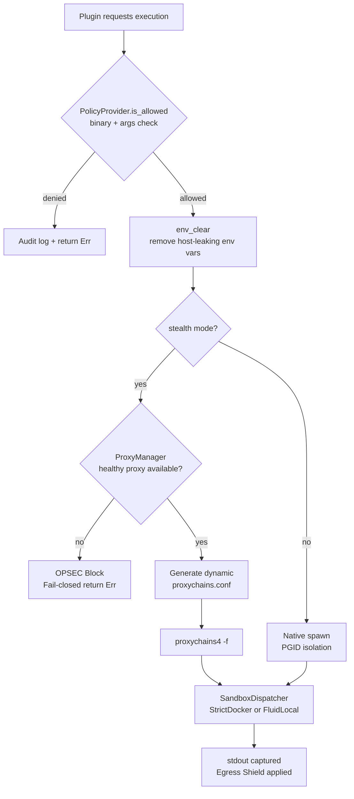
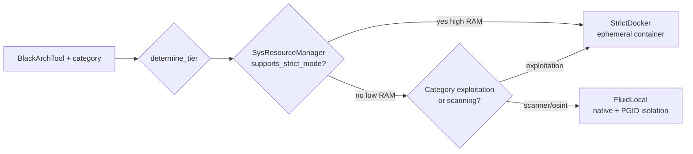
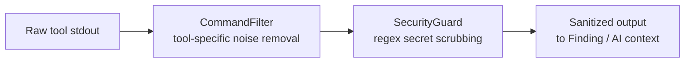
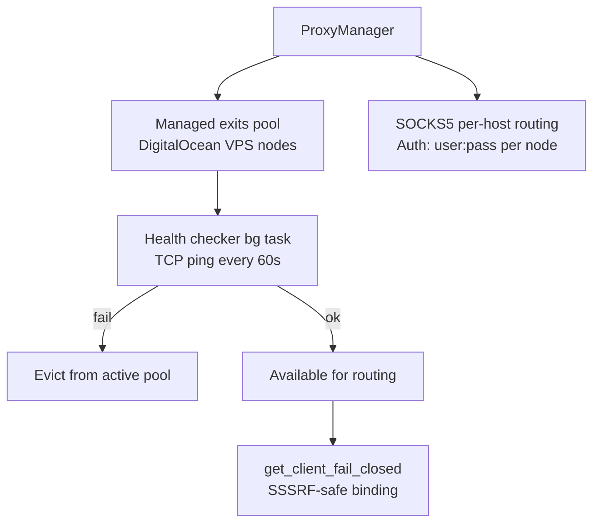
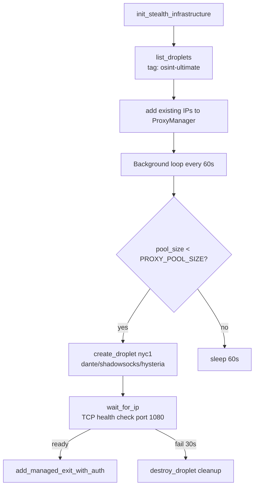

# Stealth & OPSEC Architecture

> Source-verified from `src/core/sandbox.rs`, `src/core/capability_layer.rs`, `src/utils/executor.rs`, `src/infrastructure/digital_ocean.rs`. Last verified: 2026-05-08.

---

## 1. StealthExecutor — The Only Authorized Execution Path

**File:** `src/utils/executor.rs`

All interactions with OS binaries and external tools (nmap, nuclei, etc.) route through `StealthExecutor`. Direct `tokio::process::Command` usage in plugins is a policy violation.

**Key guarantees:**
- `env_clear()` removes `HOME`, `USER`, `SHELL`, compiler paths, locale vars — prevents host fingerprinting via env leakage.
- `PolicyProvider` validates every binary path and argument list before spawn. Unknown binaries are denied.
- No proxy available in stealth mode → hard block, no execution. Never leaks real IP.

### Execution Modes

| Mode | Struct | When |
|---|---|---|
| `GhostMode` | `StealthExecutor<GhostMode>` | Default. Discovery + scanning only. |
| `StrikeMode` | `StealthExecutor<StrikeMode>` | Active exploitation + PoC validation. Requires `--max-layer exploitation`. |

---

## 2. SandboxDispatcher — Two-Tier Isolation

**File:** `src/core/sandbox.rs`

**Tier rules:**
- `StrictDocker` — ephemeral Docker container. Full network isolation, proxy-injected env vars (`ALL_PROXY`, `HTTP_PROXY`, `HTTPS_PROXY`). Used on high-RAM systems OR for any exploitation-category tool regardless of RAM.
- `FluidLocal` — native execution with PGID isolation (no Docker). Only for scanners and OSINT tools on resource-constrained systems.

**Security exception:** Category `Vulnerability | Windows | Linux` tools → always `StrictDocker`, even in low-RAM fluid mode. Exploitation tools never run natively.

---

## 3. Egress Shield — Output Sanitization

All tool output passes through a filter chain before reaching the AI or sinks:

### CommandFilter (tool-specific)
- **Nmap:** strips `NSE: Initiating...`, service transition states, progress bars.
- **Nuclei:** retains Info/Warning/Critical findings only; drops debug lines.
- ANSI escape sequences stripped universally.

### SecurityGuard (secret scrubbing regex)
Identifies and redacts:
- API keys (OpenAI, Anthropic, AWS, GitHub patterns)
- JWTs and session tokens
- Database connection strings with credentials
- Private keys (RSA PEM headers, Ed25519)

---

## 4. ProxyManager — Tactical Egress Management

**File:** `src/utils/proxy.rs`

**Key mechanisms:**
- `wait_for_readiness(timeout)` — blocks scan start until at least one egress proxy is healthy. Fail-closed: scan does not begin with no verified egress.
- `get_client_fail_closed(host)` — returns a `reqwest::Client` pre-bound to the proxy for that host. Fails hard if no proxy available (never falls back to direct connection).
- `add_managed_exit_with_auth(ip, user, pass)` — adds a DigitalOcean node to pool after SOCKS5 health check confirms it responds on port 1080.

### Stealth Infrastructure (DigitalOcean)

When `DIGITALOCEAN_TOKEN` is set and `--stealth` is active:

**Proxy modes** (set via `PROXY_MODE` env):
- `Dante` (default) — SOCKS5 with user/pass auth
- `Shadowsocks` — obfuscated proxy
- `Hysteria` — UDP-based high-throughput tunnel

### Kill Switch

On `Ctrl-C` or NATS `egress_lock` signal:
1. `pm.kill_egress()` — immediately removes all proxies from active pool.
2. `CancellationToken.cancel()` — graceful pipeline shutdown.
3. `do_client.destroy_all_ephemeral_droplets()` — destroys all DO droplets with `osint-ultimate` tag.

---

## 5. Fail-Closed Principle

Every egress path is fail-closed. If any security check fails, the operation is **aborted**, not degraded:

| Condition | Response |
|---|---|
| No verified proxy in stealth mode | `OPSEC Block` — scan does not start |
| Resolved IP in RFC1918/loopback | Target marked `Dead` — no scan |
| Unsafe C2 URL (non-https / SSRF risk) | Sink not registered — no exfil |
| Policy rejects binary | Execution aborted — audit log entry |
| Tool is exploitation-class, low-RAM | Forced to `StrictDocker` — no native fallback |

> [!CAUTION]
> Manual bypass of `StealthExecutor` (calling `Command` directly) is a policy violation. It removes audit logging, policy enforcement, and proxy routing. All external tool invocations must go through `SandboxDispatcher::run_tool()` or `StealthExecutor::execute()`.
