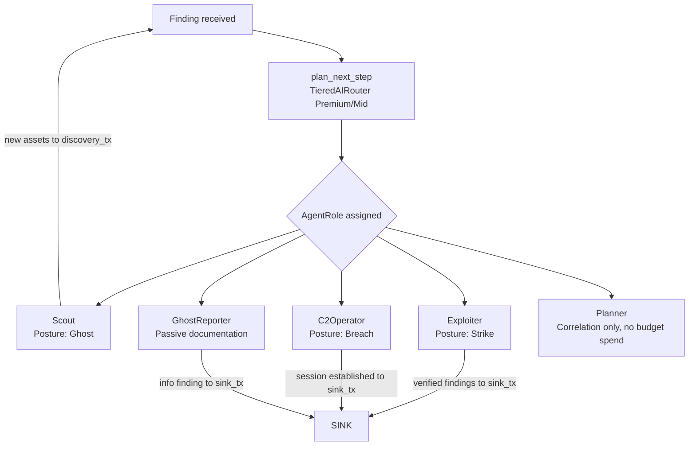
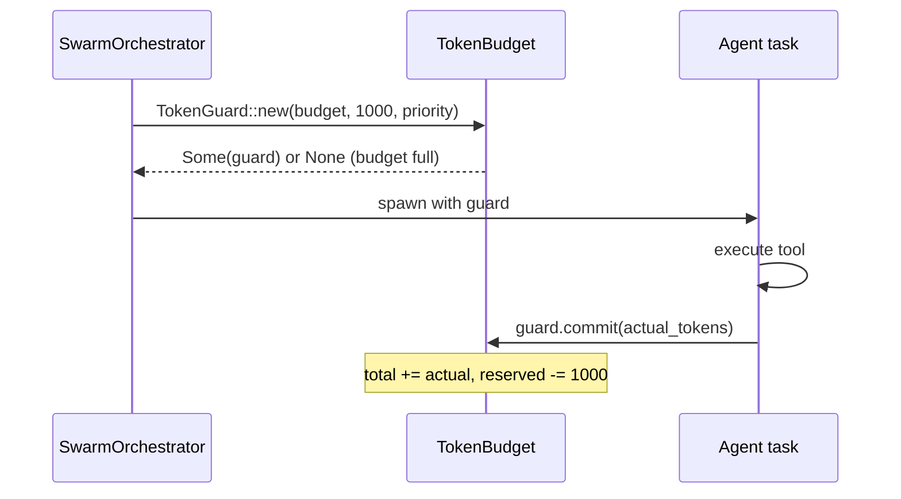
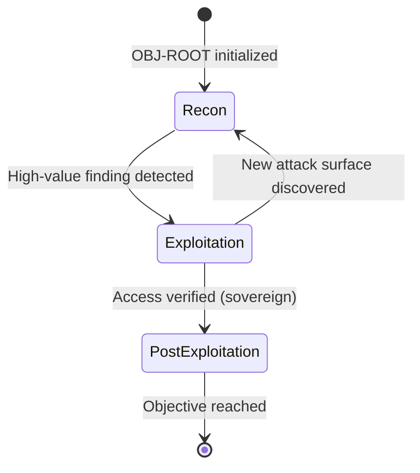
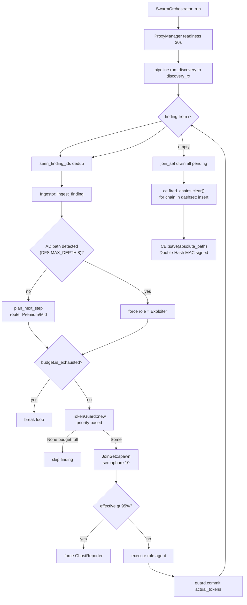

# Swarm Intelligence & Multi-Agent System

> Source-verified from `src/core/swarm/orchestrator.rs` and `src/core/swarm/budget.rs`. Last verified: 2026-05-13 (V15.1 Hardened).

---

## Overview

Swarm mode (`--swarm`) replaces sequential plugin execution with a reactive, AI-directed multi-agent system. Each finding triggers a role assignment; specialized agents execute concurrently up to the token budget limit.

Activation: `--swarm` flag → `run_pipeline(..., swarm: true)` → `Orchestrator::with_swarm_mode()`.

---

## 1. Agent Roles



| Role | `TaskPriority` | Behavior |
|---|---|---|
| `Planner` | High | Ingests finding via `Ingestor::ingest_finding`. No tool execution, costs 0 tokens. |
| `Exploiter` | Normal | Runs exploitation plugins against the finding. Generates PoC. |
| `Scout` | Low | Runs discovery/enumeration plugins. Feeds new assets back to discovery channel. |
| `C2Operator` | Low | Activates `PersistenceOrchestrator`. Requires `sovereign` feature. |
| `GhostReporter` | Low | Writes finding to sink as-is. Emergency fallback when budget > 95%. |

**AD path override:** If `CorrelationEngine` detects a high-value Windows AD attack path (total CVSS > 0.8, path contains finding's ID), role is force-upgraded to `Exploiter` regardless of `plan_next_step` result.

---

## 2. Token Budget (`TokenBudget`)

**File:** `src/core/swarm/budget.rs`

All atomic operations — no mutex required. Race-condition safe via `compare_exchange_weak` CAS loop.

```rust
pub struct TokenBudget {
    prompt_tokens:      AtomicU32,   // actual usage accumulated
    completion_tokens:  AtomicU32,
    total_tokens:       AtomicU32,   // committed usage
    reserved_tokens:    AtomicU32,   // pre-reserved before agent spawns
    max_tokens:         u32,         // set via --max-tokens
    max_per_agent:      u32,         // default: max_tokens / 2
    priority_boost:     AtomicU32,
}
```

### Priority-Based Admission Control

```
High   (Planner)   → threshold = max_tokens       (100%)
Normal (Exploiter) → threshold = max_tokens × 0.90 (90%)
Low    (Scout/C2)  → threshold = max_tokens × 0.75 (75%)
```

Low-priority agents are throttled at 75% to reserve capacity for critical analysis tasks.

### Budget Lifecycle per Agent



If agent panics or returns early: `TokenGuard::drop()` automatically releases reserved tokens via RAII. No leaked reservations on panic.

### Budget Exhaustion Responses

| Threshold | Action |
|---|---|
| > 75% total | Low-priority agents denied new `TokenGuard` |
| > 90% total | Normal-priority (Exploiter) agents denied |
| > 95% effective total | Emergency pivot: all new agents forced to `GhostReporter` regardless of role |
| == 100% | `budget.is_exhausted()` true → swarm loop breaks, no new agents |

---

## 3. Concurrency Control

```
Agent semaphore:    10 concurrent agent tasks max    (Arc<Semaphore>)
JoinSet pending:    50 max queued tasks
```

When JoinSet reaches 50 pending tasks, the finding loop blocks (`join_next().await`) until a slot frees. This provides back-pressure without unbounded task accumulation.

Panic isolation: each agent task wrapped in `AssertUnwindSafe + catch_unwind`. A panicking agent logs a critical error and is isolated — other agents continue normally.

---

## 4. Engagement State & OPPLAN (V15)

`SwarmOrchestrator` maintains an `EngagementState` with an `OPPLAN` framework:



- `EngagementState` initialized on first `run()` call if not already set.
- `root_obj` created: `"Initial Exploration"` phase `Recon`.
- Objectives can be added by agents during execution via `state.opplan.add_objective()`.

---

## 5. Proxy Readiness Gate

Before any agent spawns, the swarm verifies egress:

```rust
pm.wait_for_readiness(Duration::from_secs(30)).await
    .context("V14.1 OPSEC Block: Swarm cannot start without healthy egress proxies.")?
```

30-second timeout. Hard fail if no proxy ready — swarm does not start without verified egress.

---

## 6. Swarm vs Autonomous Mode

| Aspect | `--swarm` (SwarmOrchestrator) | `--autonomous` (AutonomousAgent) |
|---|---|---|
| Entry | `run_pipeline(swarm: true)` | `run_autopilot()` |
| Agent model | Multiple concurrent JoinSet tasks | Single sequential loop |
| Concurrency | 10 concurrent agents | 1 active at a time |
| Budget | `TokenBudget` RAII guards | Unbounded (no guard) |
| PoC validation | Via Exploiter role | `PocValidator` inline |
| AD awareness | `CorrelationEngine` AD path detect | Basic correlation |
| Engagement state | `OPPLAN` framework | `AdaptiveContext` only |
| Post-exploitation | `C2Operator` role (`sovereign`) | Not in agent.rs |

---

## 7. Swarm Decision Flow (Full)



---

## 8. ARCH-9: CE State Persistence & fired_chains Sync

At the end of `run()`, after the `JoinSet` is fully drained:

```
1. Lock CE (tokio::Mutex)
2. ce.fired_chains.clear()
3. for chain in fired_chains: Arc<dashmap::DashSet> → ce.fired_chains.insert(chain)
4. ce.save(&Self::ce_state_path())   ← Double-Hash MAC + MCP_TOKEN
```

On next `run()` startup:

```
1. ce = CorrelationEngine::load(&ce_state_path) or ::new()
2. fired_chains: Arc<dashmap::DashSet> = ce.fired_chains.iter().cloned().collect()
```

**Why two structures?** `dashmap::DashSet` is lockfree for concurrent agent writes during the run. `HashSet<String>` is `Serialize`-friendly for JSON persistence. The sync at shutdown bridges them.
